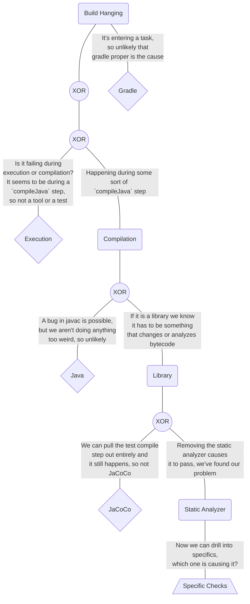
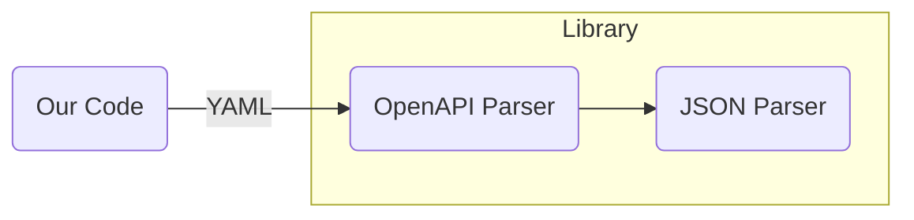
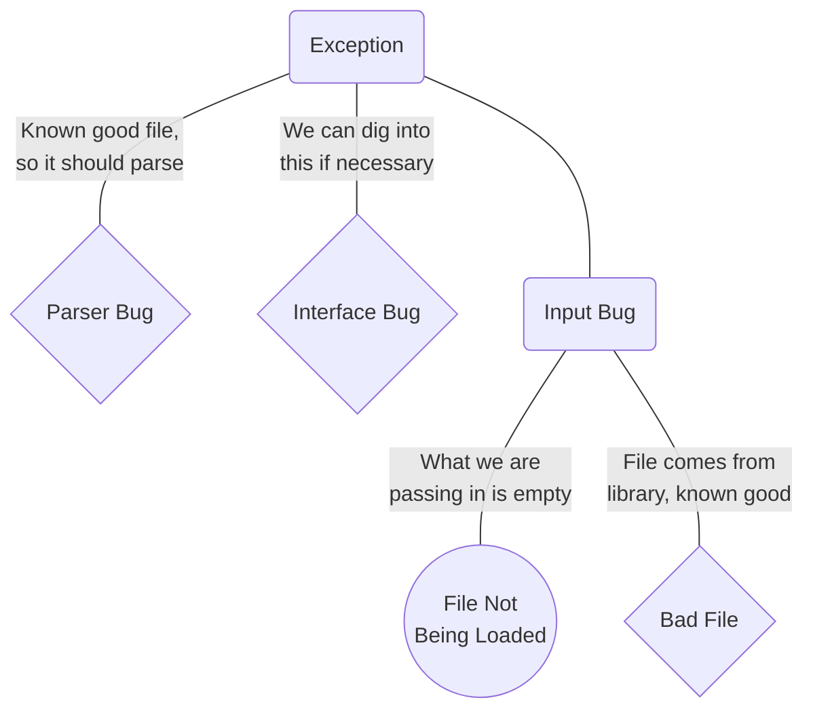

One of the skills that I use, teach, and consider fundamental to being a good engineer is the idea of a "rule out."  

The idea is basically that, when debugging, you reverse the question from "what could be happening" to "how do I demonstrate that this set of things is not happening."  Not asking "what will prove this theory correct" but rather "what will *rule out* these possibilities?"

The term comes from medicine, where it is a critical component of *differential diagnosis.*

## A Definition With Wordle

By now everyone has at least a passing familiarity with [Wordle](https://www.nytimes.com/games/wordle/index.html). It's a game where you try to guess a word in six tries, with it letting you know, at each guess:

* Which letters you get in the correct position
* Which letters appear in the word but are in the incorrect position
* Which letters do not appear in the word

In a real way, each guess you take with wordle is a *theory* where you are trying to figure out what words it *can't* be.  From the start, you have no information with which to make a guess, with each guess you gain more information, so the best strategy is often to focus on eliminating as many words as possible.

For the first few guesses especially, you are more focused on **what it can't be** rather than trying to guess **what it is**.

This is a rule out.

## An Example

We had a problem at work that had occupied three developers over two days. The compiler was hanging and they couldn't figure out why.

It took me thirty minutes to solve it and come up with a solution.

Not because I am all that, but because I knew the system well enough to start doing rule outs immediately.

Everyone in this group was convinced up one way and down the other that it had something to do with Guice—a library we were using. They couldn't figure out how, but they knew that this was the problem as the element in all of this that they had no experience with.

I knew from the symptom—the compiler hanging—that it almost certainly couldn't be Guice. Guice doesn't affect the compiler and is largely downstream of the compiler. I devised a test to double check this case and hit the compiler hang without the guice annotations.

Great.

What else could it be?

I know that the Java compiler has quirks, but is usually pretty solid and doesn't randomly hang. So what is changing the compiler?

I run the compiler and I note that we aren't getting to the test phase, so it isn't jacoco—a library that is frequently responsible for this sort of thing because it munges bytecode.

We also have a static analysis tool running that runs its own version of the compiler as part of the compiler step?

I disable the static analysis tool. Rerun it. No hanging. Culprit found. A little more diagnosis and I find the specific rule and fire a commit to disable it then file a bug with the team that handles the static analysis tool.  I quickly do differential diagnosis and also determine how we can circumvent the problem in the meantime (it has to do with a final check, so we can either disable the final check or just… not trip the final value check).

As the [saying goes](https://qlcomp.com/?p=51):

> You are paying for the 20 seconds of pushing the button and the 20 years of experience to know which button to push.

## The Core Loop

The process is essentially one of making rule outs:

1. Identify the apparent error.
2. Determine what it *can't* be.
3. Determine what it *might* be and start proving each one as Not the Problem, starting with the easiest ones and the ones that will clear the most possibilities.
4. Goto 1.

In any given situation with software a given error could be an almost (countably) infinite number of things. So being able to quickly prune entire trees and know how to test to rule out significant parts of the trees becomes a critical skill.

## Why This Works

We have several bias as humans that work against us for debugging:

1. We tend to view things as more likely culprits that we are less familiar with and tend to overestimate the likelihood of things based on recent events.  This is a form of the *availability heuristic.*
2. We tend to, on finding a possibility, try to find answers that confirm our hypothesis and reinforce our beliefs, rather than answers that eliminate the hypothesis. This is a form of *confirmation bias.*
3. We tend to look mostly to the tools we know in order to diagnose and fix the problem, which is a form of *anchoring bias.*

Performing rule outs is a way of breaking these (and other, related) biases. It forces our brain to consider alternatives and, by considering the alternatives, allows us to more quickly eliminate possibilities and narrow down on an answer.

Basically: Before we can accept something as *true*, we must first/also prove that other possibilities are *false*.

## Another Illustrative Example

A while back I was working with an intern who had been banging their head on a problem for about half a day. They were getting an error when passing a file to a parser. It looked basically like this:

They had a error where it wasn't working. So they jumped to the piece they were least familiar with: the internal library.

They started setting breakpoints inside of the third party library. Started evaluating the source code and trying to read it. They found not just the error coming out of it, but the error inside of the system that was leading to it. They were hypothesizing if the fact that it was a YAML file but the parser seemed to be geared for JSON mattered.

All questions you need to be able to ask. Eventually.

Instead, we start with the error: An illegal argument exception that is caused by some sort of parsing error. It's coming from a shallow place in the code too.

Then my brain immediately went to the possibilities:

1. It *can* be that the parser itself has a bug, but since it's a pretty solid and stable parser that seems unlikely. We can validate this is the case later by directly passing in the file if all else fails.
2. It could be a bug in the interface between their tooling and the library, e.g., calling the wrong method, needing a flag to be set, or asking it for an object type it doesn't know how to work with.
3. It could be a problem with what they are giving the library. Either because it is not being properly loaded or because it isn't in a format that the library expects.

Confirm: They got the file *from* the library. This is one of their example files. It's a known-good file. So it isn't the second half of (3). This also gives us some confidence that it isn't (1) (Core Loop Step 2).

Okay, so how can I rule out that it is a problem with what's being passed to the library? (Core Loop Step 3) Let's load it out and print it as a first step. This will tell us if what is being passed in is what we expect.

Tada. Found the problem.

The contents of the file weren't being loaded into the object, so an empty file was being passed along. The parser didn't know what to make of that and couldn't figure out how to fit it into the object type it was being asked to work with, so it was dying.

## Conclusion

This is a difficult skill that takes practice and time, but it has helped me tremendously in my career.  It's a systematic approach to problem solving that I've personally found useful and that people who I've taught it to also seem to have found useful.
