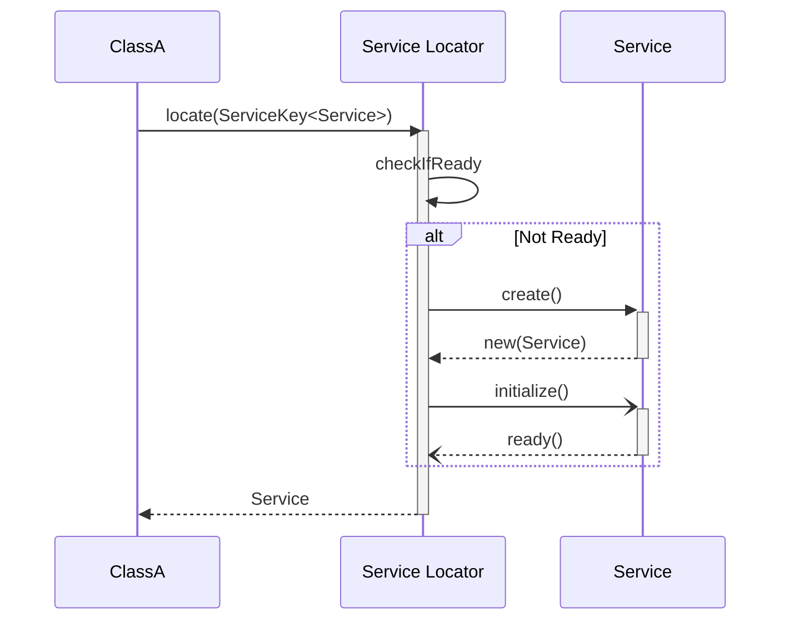
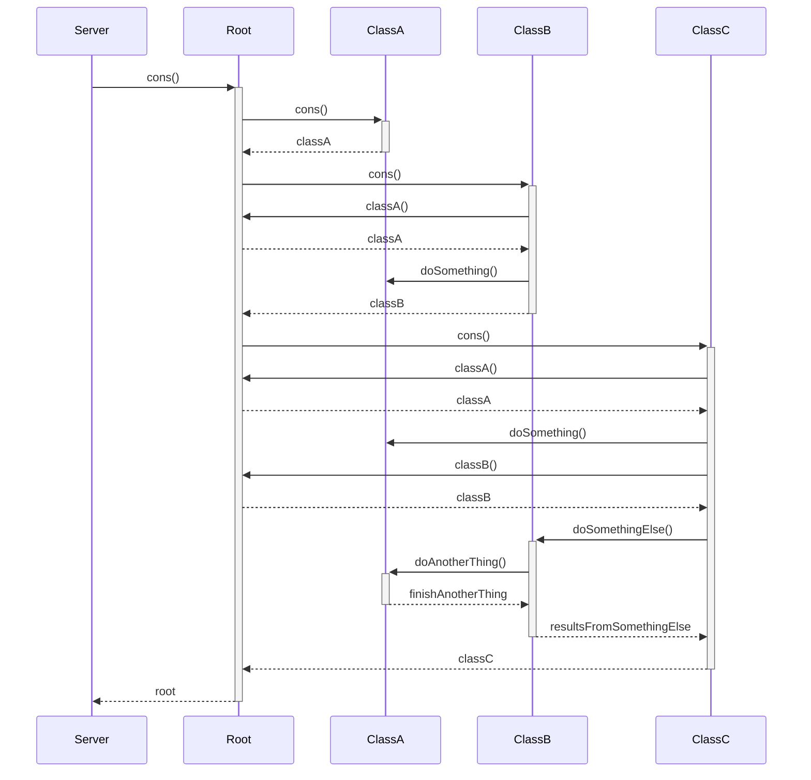
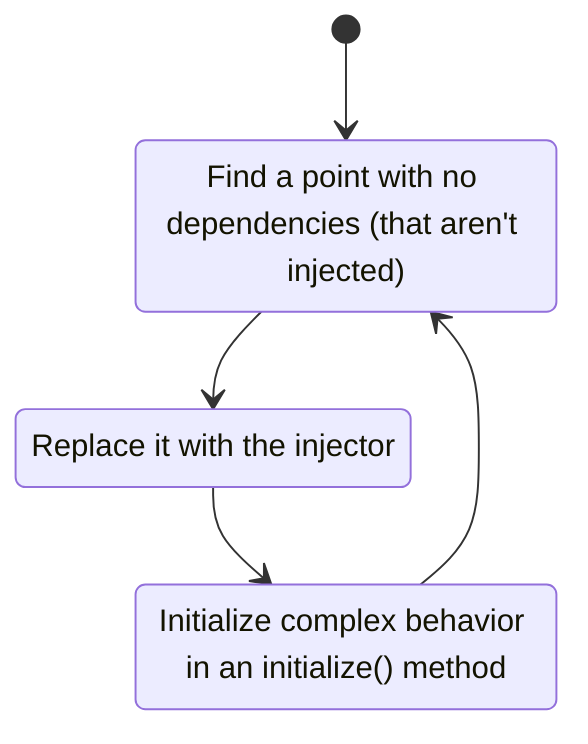
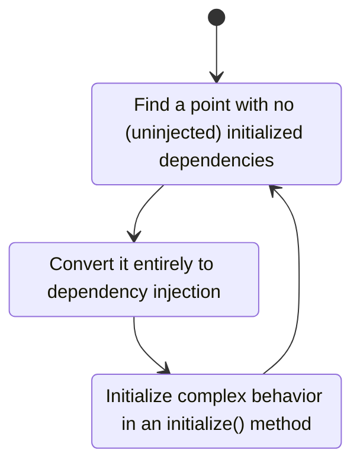
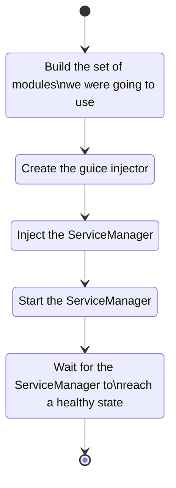
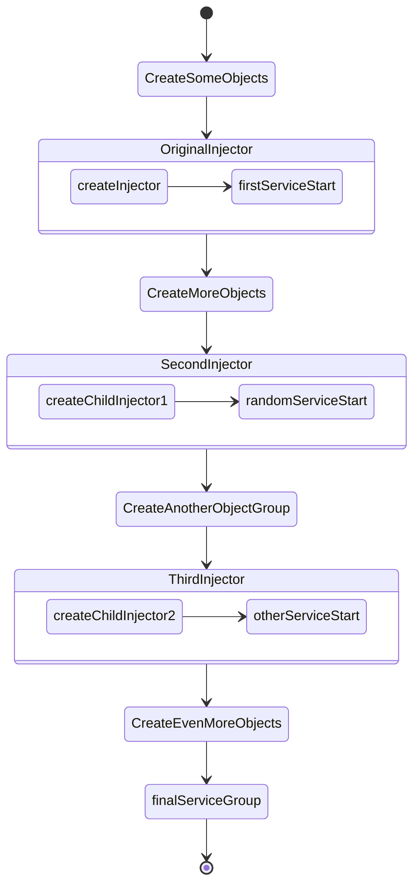

Years ago I was working on a project that had a sort of "service locator" pattern in it. This is a memory about how it got replaced with dependency injection.

I put "service locator" in quotes because a normal service locator pattern looks something like this:

```plantuml!
!theme bluegray

ClassA o-- ServiceLocator

ServiceLocator "1" *--o "*" Service

class Service<T extends Service<T>> {
  initialize()
  serviceState(): ServiceState
}
class ServiceLocator {
  locate(ServiceKey<T>) : Service<T extends Service<T>>
}
class ClassA
class "Service01<Service01>" as Service01 implements Service
class "Service02<Service02>" as Service02 implements Service

note right of ClassA: May be a service or just an unencapsulated class.
```

Then in order to _locate_ a service, you just pass the service key to the locator:



When services depend on each other you try to keep it out of the initialize step, or at a minimum keep it as a directed acyclic graph inside the initialize step so that they won't deadlock.

This is almost, but not quite, entirely unlike what this system did.

## The System's Design

While the system was clearly inspired by a service locator pattern, in an effort to make it "type safe" it had made certain allowances in its design:


```plantuml!
!theme bluegray

class ClassA
class ClassB
class ClassC

class Root {
  classA(): List<ClassA>
  classB(): ClassB
  classC(): ClassC
}

Root "1" *--o "0..*" ClassA
Root "1" *--o "1" ClassB
Root "1" *--o "1" ClassC

```

Initialization happened entirely in the constructor and with interdependencies between the classes:



Services could (and did) refer to other services outside of their constructors, which may or may not be initialized. These methods would be called by other services _inside_ their constructors.

Among other consequences:

1. It meant that the order that the services were created in the constructor was extremely fragile.
2. You had no ability to know, when you added a new call to an item, if it had any dependencies that were unresolved.
3. It was completely untestable **and** it made new code difficult to test.  This was made worse by the constructors engaging in behavior like File IO or starting threads.

This company at the time was very anti-testing for a variety of reasons, but part of it was that writing tests with a system like this led to brittle tests that were difficult to write and provided minimal value.

## Purpose of the Design

The (unfulfilled) idea was that you could have various types of system all living together not just in one code base, but one _binary_ and spin up a server with radically different characteristics through configuration alone.

This was never followed through with, but it did mean that a lot of `Root` code would end up in sometimes bizarre tools that really didn't need to be running, say, the production user management system.

This was not something that anyone really wanted to keep: it was a vision that never came to fruition, and no one really thought it would ever come to be, but a lot of the desig choices were predicated on this assumption.

## So I Set Out To Fix It

Fixing this "service locator" became a major focus for me. I wanted to convert us to dependency injection model and had chosen guice as a framework.  Guice had several advantages over other systems:

1. It required no mucking about with the build, which at that point was something incredibly perilous to change (another team was working on this problem).
2. It had support for a lot of weird edge cases, such as multibinding, circular dependencies, and things of that nature.  These aren't necessarily desireable, but they were already extant in the code and we didn't know where all of them were.
3. It worked off the standard JSR injection patterns, which facilitate doing manual injection and make testing easier.

I got a few people together who were on board, got buy-in from different parts of the org, and off we went.

### Can we start from the bottom up?

The original idea was to start at the bottom and work my way up:



Where possible, it would also help to bring pieces into a test harness, even if we couldn't write any tests for them yet.

This approach, which focused on the _degree of coupling_, had several advantages:

* **Minimally Invasive** By starting with the lowest pieces of the puzzle and working up meant that, especially at first, the components did not need excess dependencies and the modules could be kept relatively simple.  Also it meant that each individual code change would be small and would be unlikely to impact anyone who wasn't working on that exact class.
* **Fast Benefit** It could be done in small pieces—two hours here, a day there—rather than requiring a large amount of work up front.
* **Isolated** Most of the classes that fit this description were not in the critical path _per se_, or were in the critical path but their instantiation and teardown were not in the crtitical path. This meant that we could make the changes without radically altering the performance or memory characteristics of the system so that we could prove that we wouldn't impact things too badly before moving to the more critical path components.

The limitations, however, quickly became apparant as well:

1. Because of the mass of **interrelated dependencies**, we ended up needing multiple injectors that we would build on in later steps.
2. It turns out that the criteria for this actually came out to **very few cases**. Adding additional cases got more and more difficult, particularly as we started encountering classes with 15+ dependencies.
3. It was actually fairly difficult to **map how many dependencies** a given class had. Because of the problem of `A` would call `B` during the instantiation process of `C`, and because there was a lot of code that would do: `root.getA().getB().getC().doSomething()` finding which class to pick next was relatively challenging.

But the real kicker was this:

<div class="indented" markdown="1">

People who were doing development would often reach for a tool that was on `Root` but then get confused on "how to add it the right way."  They would add dependencies that were not ready to be brought in, and this meant that the **entire class would need to be revisited**.

</div>

This also meant that rather than doing dependency injection, a lot of classes would end up with a hodgepodge of dependency injection and service lookups… and we were inadvertantly encouraging them to make _more_ of a hodgepodge going forward rather than encouraging other developers to clean things up.

We had created a situation where there were pretty much two people who could actually improve the health of the code and drive the project forward.

This was, suffice it to say, undesireable.

### Enter Project Root Canal

Instead of going at it from the bottom up, what if we went at it from the top down? Focusing on the _order of initialization_ rather than the _degree of coupling_.

Basically:



This also gave us an opportunity, because most of these _needed to be_ initialized, to wrap a lot of the tooling in [Guava services](https://github.com/google/guava/wiki/ServiceExplained), which gave us better error handling and lifecycle management.

Dependencies that were not ready to be converted to DI wholesale could still inject `Root` and use that object, giving a stopgap measure to keep us from having to convert the entire system in one throw.

Basically:

1. Rather than start at the bottom and work our way up, we were starting at the top and working our way down.
2. Rather than attempting to _eliminate_ the Root object _per se_, we were hollowing it out and turning it into a wrapper for the initialization.

The outer structure of `Root` would remain exactly the same, but the inner structure of it became something simpler.

Having decided on a course of action, the initial work to get the basic framework in place took around two weeks. This kicked off the iterative process–which took months–of moving every component over to the new system.

### Making it Readable

Guice has a reputation for making code hard to read. This is especially true when it is used in highly complex ways, with architectures that involve lots of options in their module configurations (what is `Foo` bound to? who can say!). We adopted several principles in this design to make sure that we didn't end up in a worse position than where we started:

1. Every package should contain exactly one (1) `public` module. No bindings should reach outside of their module if it is possible to avoid it (no `impl` packages).  There was some flexibility on this point for multibindings. By convention this `public` module was named `<Package>Module`.
2. Every package was responsible, within its `public` module, for injecting the modules of child packages. There were a handful of exceptions to this, but we tried to make them as explicit as possible. What this meant was that, combined with (1), even if the _classes_ had dependencies all over the place, the _modules_ would form a tree that was identical to the package hierarchy.
3. Modules should contain no [conditional logic](https://github.com/google/guice/wiki/AvoidConditionalLogicInModules), with only a handful of exceptions.
4. Everything should be as explicit as possible: no implicit bindings, always use `@Inject` on constructors, and try to follow the [Law of Demeter](https://en.wikipedia.org/wiki/Law_of_Demeter) .
5. All binding logic should be inside of the modules and their associated `Provider`s. No using `@ImplementedBy` or `@ProvidedBy`.

The goal here was to simplify what we could in guice and make it as simple as possible to find and diagnose problems.  You should never have to wonder "where was this bound."  If you wanted to know the implementation for `com.example.foo.Bar` you looked for `com.example.foo.FooModule` as a starting point, and you knew it had to be bound _somewhere_ within a `Module` inside of `com.example.foo`.  This limited the search scope to a handful of classes, usually only one or two.

Using these rules, you could pretty much always find the implementation of a given object with `grep` or by hand, if need be.

It also simplified reasoning about the module layout if you always knew that `com.example.foo.FooModule` would always inject `com.example.foo.bar.BarModule` and `com.example.foo.baz.BazModule`.

### Getting Others On Board

There's a lot more to making a change of this scale and scope than just the technical work of migrating the code. A lot of other things had to start happening simultaneously, and ultimately the success of a project like this depends on more than a small group working on it. We needed to get everyone to join in on the process.

Many of the developers had started their careers with this system and only had peripheral knowledge of dependency injection as a set of principles. This necessitated a lot of different approaches to try to make sure that the ideas were widely disseminated:

1. Holding small group workshops with practice and discussion elements.
2. Larger sessions that were more theory focused.
3. Providing resources in the form of books, articles, and the like.
4. One-on-one work with individuals, especially with help debugging or tracking down problems.
5. Copious code reviews.

It also required clearing up some misconceptions:

1. That "dependency injection" is a framework. Essentially thinking that DI = Spring, Guice, Dagger, etc.
2. That merely being instantiated with guice would significantly alter the runtime performance characteristics.
3. That this was the end of the journey and after this we would be in a magical place.

### Now for the Test Harness

Meanwhile, a senior <span class="hoverover" data-toggle="tooltip" data-placemet="top" title="Software Development Engineer in Test">SDET</span> had been working on trying to get the entire thing into an integration test harness that could run against a known database.

To do this, we made sure that there were tools in place that allowed them to swap out the injector in test and we prioritized those pieces that did things that were really undesireable in a testing situation. Things like interacting with a database or opening a network socket inside of a constructor. As much as possile we tried to move these into guava services that we could initialize separately from their construction.

Now whenever someone would instantiate the service, a series of steps took place that most programmers never had to worry about or deal with:



With that done we could add a few static methods that allowed us to swap out the modules and we were good to go.

### Well, Almost

Turns out that people have a strong reflex when they see a class that looks like this:

```java
Foo(Root root) {
  this.root = root;
}
```

Become this:

```java
@Inject
Foo(
  DependencyA a,
  DependencyB b,
  DependencyC c,
  DependencyD d,
  //12 more dependencies
  DependencyQ q) {
    // ...
}
```

They have some understandable twitch reactions and second thoughts.

The thing was that, by and large, those dependencies were preexisting. It's just that previously they happened deeper in the code when `root.getQ()` was called.  It wasn't adding dependencies, instead it was revealing the dependencies that already existed.

### Refinements and Iterations

Through this we had several missteps or learning experiences along the way that caused reevaluation and backtracking or doing things differently.

#### Multiple Injectors

Our early efforts involved building multiple, [chained injectors](https://google.github.io/guice/api-docs/4.2/javadoc/com/google/inject/Injector.html#createChildInjector-java.lang.Iterable-). This was done because fo the early design philosophy of starting at the bottom and working our way up, as we often had to deal with situations where a (non-injected) object needed to use the result of injection before something else (that was injected) could be built.



This proved to be moderately disastrous as an approach:

1. This made it _extremely_ difficult to test. The construction process become fragile and any change to ordering or system construction would cause the test harness to break.
2. Because some steps depended on the initialization of previous steps, it meant that you almost couldn't use a [ServiceManager](https://github.com/google/guava/wiki/ServiceExplained) and were instead stuck with initializing every service manually.
3. It became very difficult for engineers who weren't extremely familiar with the ins and outs of guice to modify the system in any way, which was the opposite of what was desired.

#### PrivateModule

When we first started, we used `PrivateModule`s to strictly segment the code areas. This way the packages very rarely impacted each other.  Over time, it was recognized that this was not ideal.

1. `PrivateModule` did not work with a lot of the tooling that makes it easier to debug, visualize, or test guice.
2. It ended up making it harder to share certain key, central resources that were already shared. It became challenging to know whether it was more appropriate to declare a resource in the private module or in a higher level module, or to _find_ resources that might be useful that had already been bound somewhere.
3. It added another layer of conceptual complexity to an already complex system.

In the end, we did away with virtually all of the private modules, moving instead to binding annotations/qualifiers instead.

#### Testing Moving Ahead of Refactoring

In several cases testing moved ahead of refactoring, requiring us to break and fix a large body of tests that had been written to try to solve the incredibly weird problem. This was especially true when we had started from the bottom up, but it remained a problem until we had finalized the changes.

Luckily, the testing group was completey on board with our work, so it made it an easy sell in a lot of ways, but it still meant there was some avoidable churn in how we went about it.

#### Is That a Singleton?

Guice likes to deemphasize the use of singletons—for good reasons—when they aren't absolutely required. This had… odd interfacing with some of the elements of the system that depended on something being a singleton and never documented it.

This was particularly challenging for sets of objects that depended on shared locks (yes, this was a thing), where the object had some slow memory leak that hadn't been previously detected, or where a singleton was being used as a memory control.  In these cases there was no obvious reason why a singleton was the right choice–and sometimes it was in fact the wrong choice–but Bad Things™ would happen from removing that conceit from the system.

This was also challenging because a lot of bugs could crop up that were very subtle as a result of these sorts of conceits.  To catch these we had to do a lot of work with load testing, because the problems would only manifest under load. 

## Conclusion

Ultimately the project was what I'd term successful: we got the system into a stable, testable, state.  It was in many way

So that's me getting the story of how we tore apart the central conceit of a system out of _my_ system.

## References


